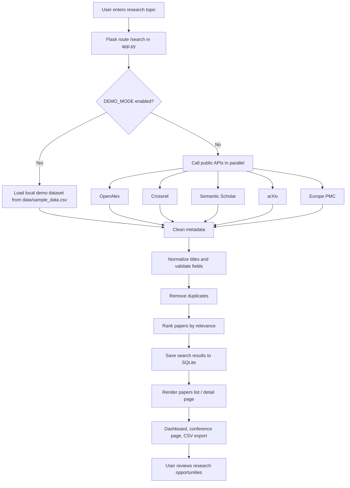

# Eureka Flow

This project follows a simple research-discovery flow from search to presentation.

## Step-by-step flow

1. The user enters a keyword or research topic on the homepage.
2. `app.py` routes the request to `search_papers()`.
3. The app chooses either demo data or live API data based on `DEMO_MODE`.
4. Search results are fetched from multiple sources at once using `ThreadPoolExecutor`.
5. `services/data_cleaner.py` validates and standardizes fields like title, year, DOI, and URL.
6. `services/deduplicator.py` removes duplicate entries across sources.
7. `services/ranking.py` applies a relevance score so the most relevant papers rise to the top.
8. `database/db.py` stores the search history and paper rows in SQLite.
9. HTML templates display the results, details, dashboard, and conference information.

## Key modules

- `app.py`: main Flask app and route logic
- `api/`: API client modules for external data providers
- `services/`: cleaning, deduplication, ranking, and caching logic
- `database/db.py`: SQLite schema and persistence
- `templates/`: Jinja HTML view templates
- `static/`: CSS and JavaScript frontend assets
- `data/`: demo CSV and local database file
- `tests/`: unit tests for core processing

## End result

The flow produces a usable research shortlist from raw, inconsistent external data and turns it into a clean, ranked, navigable interface for exploration and decision-making.
